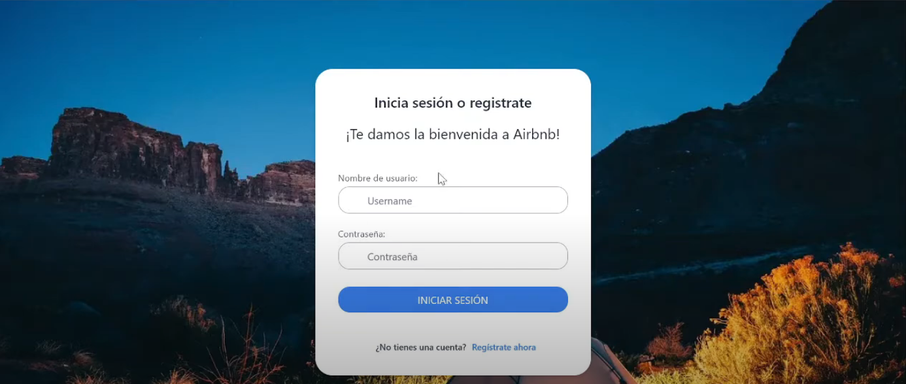
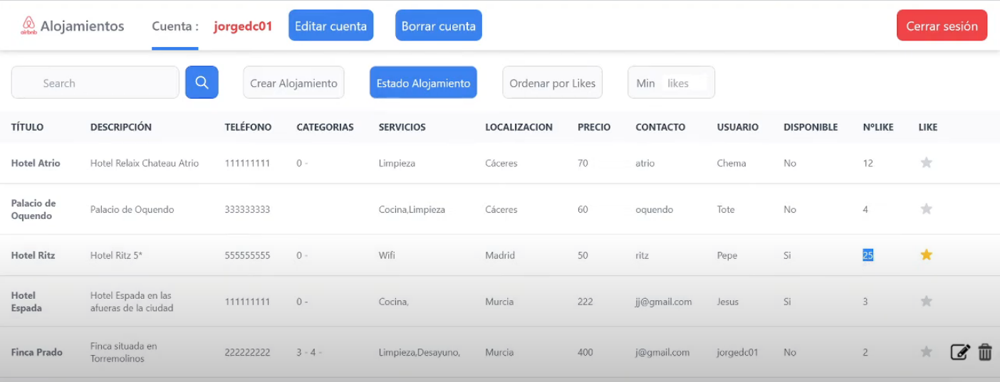
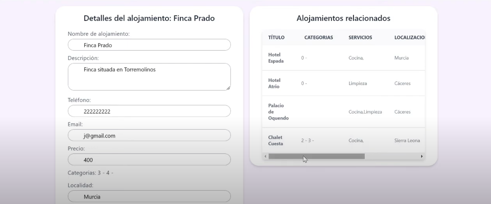

# Web Application Project - Servlets & JSP

This repository contains the web application developed for the **Programming in Internet** course. The application allows users to manage accommodations using HTML, CSS, Servlets, and JSP technologies. Below is an overview of the project and the key functionalities implemented.

## Project Overview

The objective of this project is to create a web application that allows users to register, manage accommodations, and interact with other users. The system is divided into several key functionalities, which meet both **functional** and **non-functional requirements** specified for the assignment.

### Main Features

#### 1. User Registration
- Users can register with a username, email, and secure password.
- After registration, users can edit their email and password or delete their account at any time.
- The profile editing feature pre-loads existing user data.

#### 2. Accommodation Management
- Users can create, view, edit, and delete accommodations.
- Each accommodation includes the following fields:
  - Name (Text)
  - Description (Textarea)
  - Phone (Tel)
  - Contact Email (Email)
  - Price (Number)
  - Category (Dropdown select)
  - Location (Text)
  - Services (Checkboxes)
- When editing an accommodation, all previously entered data is loaded, and users can delete the accommodation if needed.

#### 3. Favorites System
- Users can mark accommodations as favorites, reflecting their quality-price opinions.
- Accommodations are displayed with the number of favorites, and users can filter accommodations based on their popularity.
- Users can remove favorites they previously marked.

#### 4. Search Functionality
- Users can search for accommodations using keywords from the title or description.

#### 5. Accommodation Status
- Users can change the status of their accommodations between "Available" and "Reserved."
- The application provides three viewing options:
  - **All**: Shows all accommodations.
  - **Available**: Shows only the accommodations that are still available.
  - **Reserved**: Shows accommodations that have already been reserved.

## Additional Features (Optional)

To achieve the highest grade, several optional features were implemented, including:

#### 1. Category Management
- Users can create, edit, list, and delete accommodation categories.
- Categories can be added or removed from accommodations.

#### 2. User Comments and Ratings
- Users can leave comments and rate accommodations (1-5 stars).
- Comments can be filtered based on ratings.

#### 3. Advanced Search
- Users can filter search results by category, location, comments, services, and price range.

#### 4. Related Accommodations
- When viewing the details of an accommodation, related accommodations are displayed based on category, location, price, or services.

#### 5. Image Management
- Users can add, edit, and delete profile pictures and accommodation images.

#### 6. Internal Messaging System
- Users can send private messages to each other, which are only visible to the intended recipient.

#### 7. Display Favorite Profiles
- The details page of an accommodation shows the profile pictures of users who have marked it as a favorite.

#### 8. Quick Access to Promotions
- Users can access promotional accommodations through a dedicated section with identifying images.

#### 9. Reservation Management
- The system allows users to make reservations for accommodations by date. Overlapping reservations are prevented.

#### 10. Social Media Panel
- Accommodations have a social media panel where users can view the accommodation's profile on platforms like Twitter.

#### 11. Graphical Statistics
- Users can view graphical statistics related to their accommodations, including the number of favorites, ratings, and views, categorized by day, week, month, or year.

#### 12. High-Quality User Interface
- The application features a responsive, high-quality user interface.

## Non-Functional Requirements

The application meets several key non-functional requirements:
1. **Valid HTML and CSS**: The application adheres to best practices in HTML and CSS, and is valid unless errors are caused by JSP.
2. **Security**: The application encrypts communication between the client and server, and ensures that users cannot access or modify others' information.
3. **Good Practices**: The project follows good coding practices and patterns taught throughout the course.

## Running the Project

1. Clone the repository:
   ```bash
   git clone https://github.com/yourusername/webapp-servlets-jsp.git
   cd webapp-servlets-jsp
   
2. Import the project into Eclipse (or your preferred Java IDE), ensuring it supports Servlets and JSP.

3. Deploy the project on a servlet container such as Apache Tomcat and run the web application.

4. Access the web application via the local server URL (e.g., http://localhost:8080/webapp).

## Airbnb App 's images





